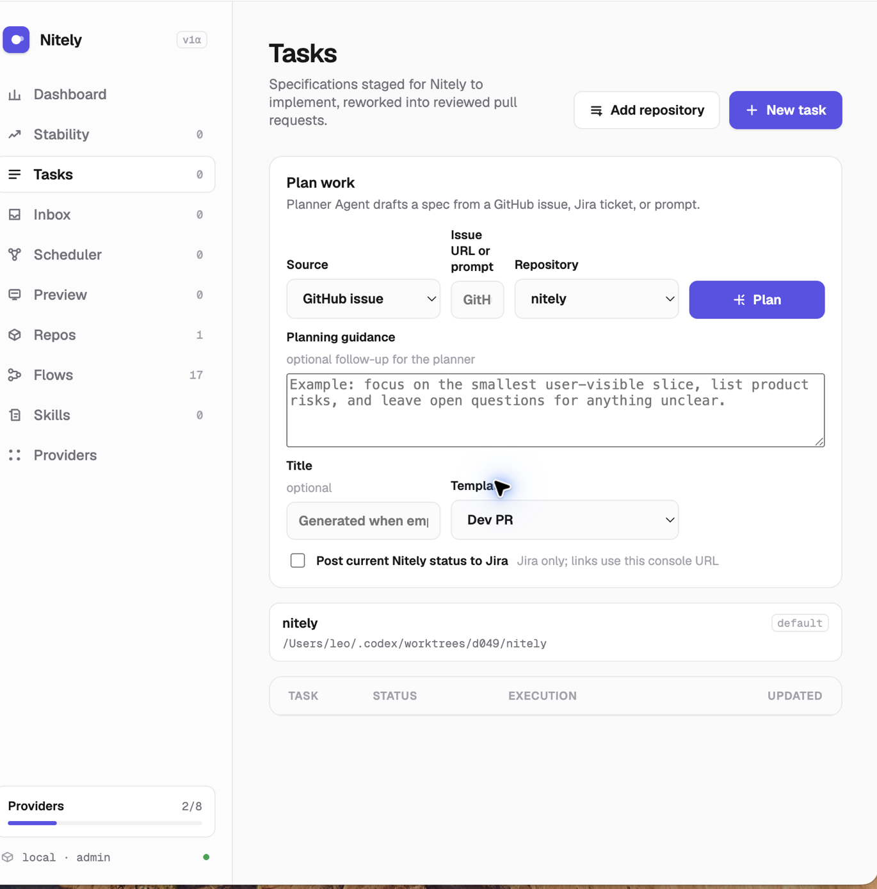
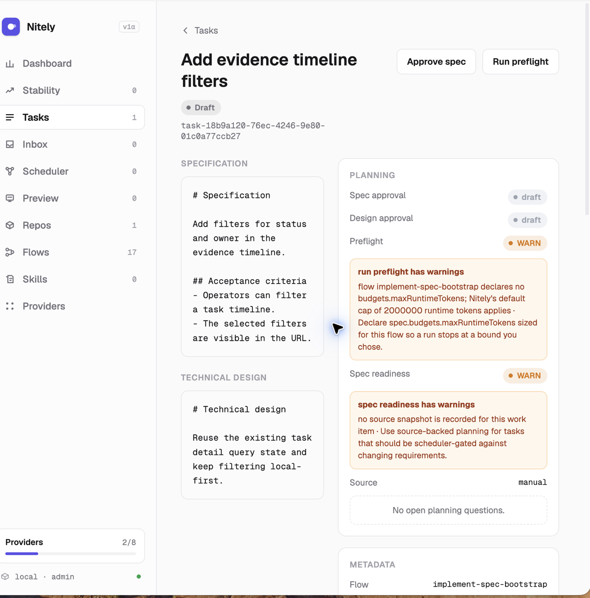
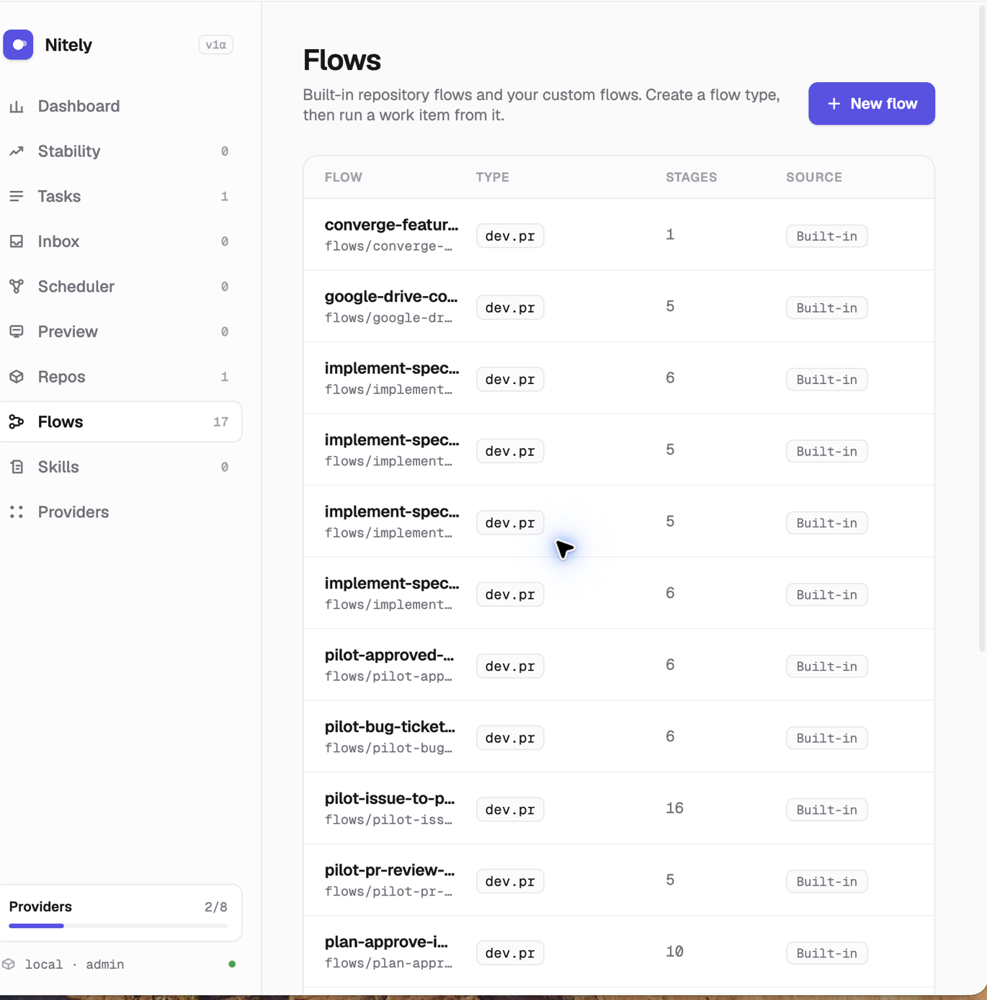
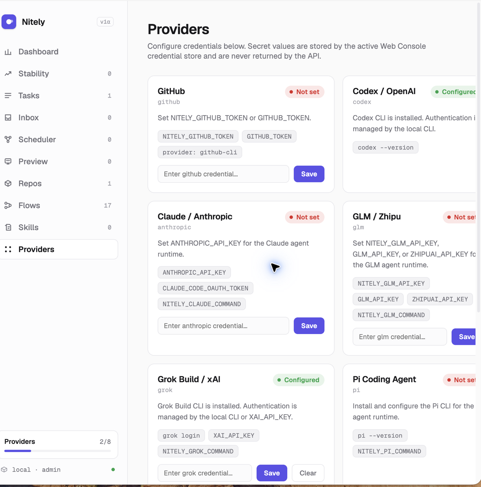

# Web Console

The local Web Console: what it shows, and how to start it. Remote CLI commands against that server are in [remote-operations.md](remote-operations.md).

Start the local console from a repository checkout:

```bash
nitely web --home . --host 127.0.0.1 --port 4173
```

The console centers on **Tasks** as the user-facing unit of work. `/tasks`
lists legacy `.nitely/tasks` records, generic `.nitely/work-items` records, and
historical runs that can be inferred as read-only tasks. `/tasks/<task-id>`
opens the canonical task detail view with metadata, input sources, local
specification and technical design content when available, associated sessions,
change request links, and typed artifact groups. Internally, generic
`.nitely/work-items` records remain the extensibility model for custom flows;
`/work-items` aliases back to `/tasks` in the Web Console for compatibility.
The **Plan work** form on `/tasks` creates draft tasks from a GitHub issue URL,
Jira ticket URL or key, an external document, or a rough prompt through the
Planner Agent workflow. On task detail, approve the draft spec, draft the
technical design, review persisted open questions, approve the technical
design, and then start the normal implementation run. Runs remain blocked until
both `specStatus` and `techDesignStatus` are `approved`. The Web Console, the
CLI, and `POST /api/draft-specs` share those transitions; see
[docs/planning-intake.md](planning-intake.md) for the intake contract,
source provenance, and drift behavior.

External document intake carries a document URL plus the snapshot text a
connector fetched, with an optional provider revision. Nitely stores the URL,
snapshot, and a content hash as the planning baseline; it never fetches the
document itself and never stores provider credentials. Re-submitting the same
document URL reuses its task and records drift when the snapshot changed.
GitHub issue intake uses configured Web Console GitHub provider credentials, or
`NITELY_GITHUB_TOKEN` / `GITHUB_TOKEN`, and falls back to unauthenticated fetching
for public issues.

## Visual tour

These screenshots show the main local-first workflow. They come from the current
Web Console and contain no credentials or production data.

| Tasks and planning | Task approval and preflight |
| --- | --- |
|  |  |

| Flow catalog | Provider setup |
| --- | --- |
|  |  |

GitHub webhook activation is disabled by default. It accepts fresh, signed
`issues:labeled`, configured `issues:assigned`, configured issue mention, and
configured pull-request review-comment events for an explicitly mapped
repository, allowed sender, optional installation allowlist, and configured
triggers. It durably queues the delivery at `POST /api/github/webhooks`, returns
HTTP 202, and asynchronously creates either an approval-gated draft task or a
pending same-PR task rework request; it never starts a run.
Configure it without putting the webhook secret on the command line:

```bash
NITELY_GITHUB_WEBHOOK_SECRET='replace-with-the-hook-secret' \
NITELY_GITHUB_WEBHOOK_REPOSITORIES='acme/widgets=acme-widgets' \
NITELY_GITHUB_WEBHOOK_ACTORS='trusted-maintainer,nitely-bot' \
NITELY_GITHUB_WEBHOOK_INSTALLATIONS='123456' \
NITELY_GITHUB_WEBHOOK_LABELS='nitely' \
NITELY_GITHUB_WEBHOOK_ASSIGNEES='nitely-bot' \
NITELY_GITHUB_WEBHOOK_MENTIONS='@nitely' \
NITELY_GITHUB_WEBHOOK_FLOW='flows/implement-spec-bootstrap.json' \
NITELY_GITHUB_WEBHOOK_REWORK_FLOW='flows/rework-pr-bootstrap.json' \
nitely web --home . --host 127.0.0.1 --port 4173
```

The right-hand side of each mapping is the repository id shown on the Repos
page; the home checkout registers itself from its `origin` as
`<owner>-<repo>`.

To publish bounded GitHub App callbacks, add App credentials to the same Web
process environment:

```bash
NITELY_GITHUB_APP_ID='12345' \
NITELY_GITHUB_APP_PRIVATE_KEY_BASE64='base64-encoded-pem' \
NITELY_GITHUB_WEBHOOK_STATUS_BASE_URL='https://nitely.example' \
NITELY_GITHUB_WEBHOOK_CHECK_NAME='Nitely' \
nitely web --home . --host 127.0.0.1 --port 4173
```

The secret, repository mapping, actor allowlist, and Flow are required.
`NITELY_GITHUB_WEBHOOK_INSTALLATIONS` is optional; when omitted, only the
installation-id check is skipped. Repository and actor policy never becomes a
wildcard. Labels default to `nitely`. The HMAC secret is not written to disk.
Delivery ids, normalized provenance, immutable source snapshots, and queue state
are stored under `.nitely/github-webhooks/`; duplicate delivery ids cannot start
duplicate work. When the GitHub App publisher is configured, Nitely exchanges a
short-lived per-installation token scoped to the webhook repository and writes
one bounded issue/PR comment; PR review-comment rework deliveries also create or
update one GitHub Check Run on the PR head SHA. The callback does not include
issue body text, reviewer instructions, secrets, or raw provider errors.
Automatic run start remains outside this slice. Webhook delivery processing uses
a delivery-level lease so multiple Web processes sharing a state directory do not
process the same queued delivery concurrently; an expired lease can be reclaimed
after worker death.

Jira ticket intake accepts an Atlassian Cloud browse URL. Bare ticket keys and
self-hosted Jira URLs require an allow-listed `NITELY_JIRA_BASE_URL`. Configure
the token through the Web Console Jira provider or with `NITELY_JIRA_TOKEN` /
`JIRA_API_TOKEN`. Set `NITELY_JIRA_EMAIL` to use Jira Cloud Basic authentication
with `email:token`; without an email, Nitely sends the credential as a Bearer
token for OAuth/PAT deployments. Jira credentials stay in the customer-owned
provider store or process environment and are not copied into task snapshots.

Jira status sync is disabled by default. Selecting **Post current Nitely status
to Jira** during intake stores the current console origin as the link base and
posts a bounded Jira comment. The task detail **Sync to Jira** action publishes
later task/run/PR changes; identical projections are skipped. A failed comment
does not discard the local planning task and can be retried after fixing access.

After changing GitHub provider or draft-spec ingestion behavior, smoke the
configured dev Web path instead of relying only on shell credentials:

```bash
pnpm dev -- web --home ../nitely-runtime --port 4174 &
NITELY_SERVER_URL=http://127.0.0.1:4174 \
  pnpm dev -- smoke github-issue-intake \
  --issue https://github.com/<owner>/<repo>/issues/<number>
```

Configure the GitHub provider through the Web Console provider settings before
running the smoke when the issue requires repository access. If the provider is
not configured, the smoke exits successfully with a skip reason; if configured
credentials are missing access, it fails with the same actionable guidance as
`POST /api/draft-specs`. The command reports only issue/task/source metadata and
does not print token values.
Implementation changes to planning approval endpoints or
`src/work-items/planning.ts` should include deterministic negative transition
tests for the affected state-machine paths.
Session list and detail views include latest execution status, stage progress,
change request links, branch/worktree metadata, context manifests, context
usage, sanitized logs/evidence, review findings, and parent/child rework links
when available. Context manifests prefer safe fetched input metadata from run
snapshots over raw connector references, while timelines preserve known stage
types and lightweight resume/rework markers. `/runs` remains the
backward-compatible route for the Sessions view, and `/runs/<run-id>` opens a
first-class agent session detail page for completed, failed, running,
interrupted, and incomplete runs.

Operator summaries reject placeholder streams and numeric-only counters in
favor of state-first explanations. Active stage cards expose the declared
command or runtime/model, heartbeat-derived process activity, and declared
artifact readiness. `alive: true` means the attempt is open and has recent
persisted activity; it is not a durable OS PID claim. During long-running
command, agent, and review attempts, Nitely checkpoints a bounded
`recovery.patch` plus `recovery.json` relative to the attempt's starting commit.
Interrupted runs surface that run-relative recovery path, while published runs
group branch, head commit, and PR metadata.

By default the console runs in local compatibility mode on a loopback listener.
Requests use a synthetic `local` admin user, legacy tasks and runs without
`ownerId` remain visible, and provider writes continue to use
`.nitely/connections.json`. Nitely refuses local mode in production or on a
non-loopback bind.

For a shared console, require login:

```bash
NITELY_ADMIN_EMAIL=admin@example.test \
NITELY_ADMIN_PASSWORD='replace-with-a-unique-long-passphrase' \
nitely web --home . --host 127.0.0.1 --port 4173 --auth required
```

`NITELY_WEB_AUTH=required` is also supported. On first start, if
`.nitely/users/users.json` is empty and the admin environment variables are set,
Nitely creates the initial admin. Required mode stores users in
`.nitely/users/users.json`, sessions in `.nitely/users/sessions/`, and
Web-saved provider credentials in `.nitely/users/<user-id>/connections.json`.
Passwords are salted `scrypt` hashes. API responses include only public user
fields and provider status; secret values are never returned.
Initial creation is recorded as a metadata-only `auth.bootstrap` security event.
Bootstrap first persists a private recovery intent, then durably commits the
user, default organization, and fixed-ID audit event before marking that intent
complete. An interrupted start replays pending steps without requiring the
plaintext password again and without duplicating the administrator or audit
event. The completed marker retains identifiers only, not password verifier
data.
Production and non-loopback startup fail before listening if no administrator
exists. Bootstrap the first account in a one-time foreground start with explicit
credentials; do not put those credentials in a systemd unit.

New passwords must contain 15–128 Unicode code points and must not match the
built-in or optional `.nitely/users/password-blocklist.txt` deny list. Login
failures are account-keyed and throttled after five failures in 15 minutes by
default. Set `NITELY_WEB_SECURE_COOKIE=true` when the console is served through
HTTPS; leave it unset for plain loopback HTTP.

A non-loopback bind additionally requires an operator-declared TLS reverse-proxy
boundary and either secure cookies or an explicit insecure test-cookie escape
hatch for LAN HTTP dogfood:

```bash
NITELY_WEB_AUTH=required \
NITELY_WEB_TRUSTED_PROXY=true \
NITELY_WEB_SECURE_COOKIE=true \
nitely web --home . --host 0.0.0.0 --port 4173
```

For trusted-proxy production Web over plain LAN HTTP (for example
`http://0.0.0.0:4173`), set `NITELY_WEB_INSECURE_TEST_COOKIE=true` instead of
`NITELY_WEB_SECURE_COOKIE=true`. Prefer secure cookies behind HTTPS.

The proxy/firewall must prevent clients from bypassing that boundary. Nitely
does not terminate TLS in this slice. `GET /api/readiness` and the CLI startup
output report auth, administrator, bind, proxy, cookie, and production controls
without exposing credentials.

Tasks created through the authenticated Web Console include `ownerId`, and runs
started from those tasks inherit it. Organization members see records in their
organizations, with named owner/maintainer/member/viewer permissions; legacy
unowned data remains hidden from normal users. Global admins can inspect it.
Required-auth repository catalog entries are owned by the caller's current
workspace, and organization owners and maintainers can onboard them. The entry
registered from the home checkout's `origin` (the `home` entry) is visible to
every authenticated user; every other repository follows workspace/organization
ownership. Legacy stored catalog entries without an `organizationId` stay
admin-only until assigned.
Security decisions are written as metadata-only events to
`.nitely/security/audit.jsonl`. See
[docs/enterprise-identity-rbac-and-audit.md](enterprise-identity-rbac-and-audit.md)
for the permission matrix, password/session controls, audit schema, admin
session revocation, and future OIDC/SCIM boundary.

The local JSON API exposes:

- `GET /api/tasks`
- `POST /api/tasks`
- `POST /api/draft-specs`
- `GET /api/tasks/:taskId`
- `POST /api/tasks/:taskId/approve-spec`
- `POST /api/tasks/:taskId/draft-tech-design`
- `POST /api/tasks/:taskId/approve-tech-design`
- `POST /api/tasks/:taskId/runs`
- `GET /api/work-items` and `GET /api/work-items/:id` remain compatibility APIs
  for internal/extensible work item clients.
- `GET /api/scheduler`
- `POST /api/scheduler/run`
- `GET /api/runs`
- `GET /api/runs/:runId`
- `GET /api/providers`
- `GET /api/session`
- `POST /api/session`
- `DELETE /api/session`
- `DELETE /api/users/:userId/sessions` (global admin)
- `GET /api/security/audit` (global admin)

`POST /api/tasks` accepts optional `planningStatus: "draft" | "ready"`.
`ready` is the compatibility default; `draft` marks both supplied planning
artifacts as drafts so an external approval client can approve them before a
run.
